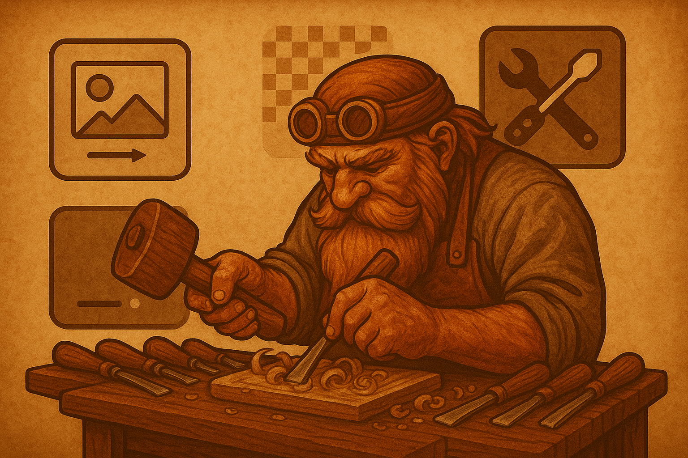

# Woodcarving Helper IT Tools

**[Українська версія](README_UA.md)**

# 🛠️ Wood Carving Helper Tools

A collection of useful Python scripts for image processing and PDF creation for wood carving projects.  

 

## 🧰 Available Tools

1. **remove_background.py** — automatic background removal from images, saves alpha mask.
2. **apply_mask.py** — apply an edited alpha mask to the original image.
3. **image_to_pdf.py** — convert an image to PDF with exact physical print size.
4. **poster_splitter.py** — scale image to desired size, split into A4 sheets, generate PDF poster with marks and coordinates for assembly.

## 🖤 Manual Transparency (Alpha Mask) Editing

1. Run background removal with mask saving:
   ```bash
   python remove_background.py your_image.jpg -a --save-mask
   ```
   This will create a file like `your_image_no_bg_mask.png`.
2. Open the mask in a graphics editor (Photoshop, GIMP), fix details (legs, thin elements), and save.
3. Apply the edited mask to the original image:
   ```bash
   python apply_mask.py your_image.jpg your_image_no_bg_mask.png -o your_image_final.png
   ```
   The result will be a perfect PNG with transparent background.

**The `apply_mask.py` script is included in the project!**

## 🖨️ Splitting an Image into a Multi-Page Poster Template

The script `poster_splitter.py` allows you to scale an image to a specified physical size, split it into the required number of A4 sheets, and generate a PDF for printing a large template.

### Key features:
- Proportional image scaling (no distortion)
- Adds white margins if aspect ratio does not match
- Splits into A4 sheets
- Adds alignment marks (lines in corners)
- Adds page coordinates in the top left corner (e.g., Row 2, Col 1)

### Example usage:
```bash
python poster_splitter.py IMG_5989-removebg-preview.png -w 40 -t 30 -o IMG_5989_poster.pdf
```
- `-w` — template width in cm
- `-t` — template height in cm
- `-o` — output PDF filename

**Each PDF page will have a label in the top left corner with coordinates (row, column) to help you assemble the template correctly.**

## 🚀 Quick Start

### Installation
```bash
# Clone repository
git clone https://github.com/igorgorovoy/woodcarving-helpers-it-tools.git
cd woodcarving-helpers-it-tools

# Create virtual environment
python -m venv venv
source venv/bin/activate  # On Windows: venv\Scripts\activate

# Install dependencies
pip install -r requirements.txt
```

### Example Workflow
```bash
# 1. Remove background from carving photo
python remove_background.py IMG_5989.JPG -a

# 2. Convert to PDF with 10 cm size
python image_to_pdf.py IMG_5989_no_bg.png -s 10 -o carving_10cm.pdf
```

## 📚 Detailed Documentation

- [Background Removal Documentation](remove_background_README_EN.md)

## 🎯 Typical Use Cases

### For Wood Carving
1. **Photograph your work** - take a photo of your carving
2. **Remove background** - use `remove_background.py` for cleanup
3. **Create template** - convert to PDF with desired size
4. **Print** - print for use as a template

### For Portfolio
1. **Process photos** - remove unwanted backgrounds
2. **Create catalog** - make PDF with uniform sizes
3. **Professional presentation** - clean look without background

## 🔧 Technical Requirements

- **Python 3.7+**
- **Minimum 2GB RAM** (for background removal)
- **Internet connection** (for first background removal run)

## 📦 Dependencies

- `Pillow` - image processing
- `reportlab` - PDF creation
- `rembg` - AI-powered background removal

## 🤝 Contributing

If you have ideas for new tools or improvements, create issues or pull requests!

## 📄 License

This project is distributed under the MIT license. 